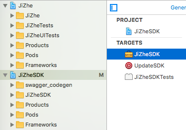
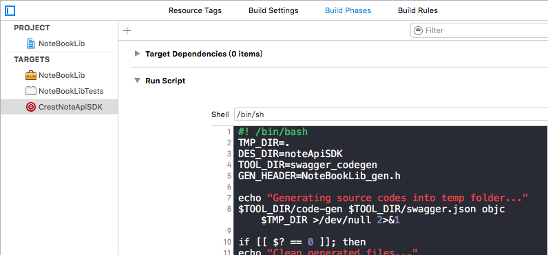

# 简介
这是笔记本应用《记着》的iOS客户端。是一个使用了Swagger-codegen框架的具体实践。项目架构`ReactiveCocoa+MVVM`。
# 截图

# 使用
  本应用使用Swagger框架生成网络请求的SDK。


## 1. 将[代码生成工具](https://github.com/swagger-api/swagger-codegen#prerequisites)集成到项目中

  具体思路是在iOS项目中添加Aggregate，在其中执行shell脚本，利用代码生成工具生成代码，并将其做成Framework，然后引入到项目中。

  首先将新建一个WorkSpace，添加一个project，这是项目主工程；然后再添加一个Framework，代码生成器和生成代码都将在这个工程内。将`NoteBook/NoteBookLib/swagger_codegen/`文件夹拖入Framework这个工程中，类似与这样

  在SDK这个工程内添加一个Aggregate，并将`NoteBook/NoteBookLib/swagger_codegen/swagger.sh`文件中的shell脚本

```shell
#! /bin/bash
TMP_DIR=.
DES_DIR=noteApiSDK #代码生成目录
TOOL_DIR=swagger_codegen #工具所在目录
GEN_HEADER=NoteBookLib_gen.h #生成代码头文件

echo "Generating source codes into temp folder..."
$TOOL_DIR/code-gen $TOOL_DIR/swagger.json objc $TMP_DIR >/dev/null 2>&1

if [[ $? == 0 ]]; then
echo "Clean generated files..."
rm -f NoteBookLib/$GEN_HEADER
rm -f NoteBookLib/$DES_DIR

echo "Generating $GEN_HEADER"

for file in $(ls "$TMP_DIR/client" | grep \\.h); do
echo "#import \"$DES_DIR/$file\"" >> NoteBookLib/$GEN_HEADER
done

echo "Moving generted files..."
mkdir -p "NoteBookLib/$DES_DIR"
mv $TMP_DIR/client/* NoteBookLib/$DES_DIR/

rm -r "$TMP_DIR/client"
rm -f "$TMP_DIR/Podfile"
fi
```
  复制到运行脚本中，如下图

注意需要修改脚本与你的文件目录一致。

如果脚本书写正确，执行这个集合后，文件目录内会生成一个文件和一个头文件，将其添加到Framework工程中，然后编译，会发现缺少头文件
，这是因为生成的SDK依赖于`AFNetworking`、`JSONModel`、`ISO8601`这三个第三方库，所以需要使用Cocopodps来将这几个库引入到工程中，Podfile编辑如下

```ruby
platform :ios, '7.0'

workspace 'NoteBook'

# Dummy default project
project 'NoteBook/NoteBook.xcodeproj'

target :NoteBookLib do
    project 'NoteBookLib/NoteBookLib.xcodeproj'

    pod 'AFNetworking', '2.6.0', :inhibit_warnings => true
end

def testing_pods
    pod 'Masonry', '0.6.1'
    pod 'MJRefresh', '1.4.1'
    pod 'MBProgressHUD', '0.9.1'
    pod 'AJWValidator', '0.0.7'
    pod 'Tortuga22-NinePatch', '0.1.1', :inhibit_warnings => true
    pod 'JSONModel', '1.1.0'
    pod 'ISO8601', '0.3.0'
end
target :"NoteBook" do
    project 'NoteBook/NoteBook.xcodeproj'
    testing_pods
    pod 'MMMarkdown'
#    pod 'Reveal-iOS-SDK', '1.5.1', :configurations => ['Debug']
    pod 'ReactiveCocoa', '2.4.7'
    pod 'ReactiveViewModel', '0.3'
    pod 'CocoaLumberjack', '2.0.0-rc'
    pod 'UMengSocialCOM', '~> 5.1'
    pod 'FMDB'
    pod 'OneAPM','~> 2.2.1'
    pod 'JSPatch'
end
target :"NoteBookTests" do
    testing_pods
end
if defined? installer_representation.project
    post_install do |installer_representation|
        installer_representation.project.targets.each do |target|
            target.build_configurations.each do |config|
                config.build_settings['IPHONEOS_DEPLOYMENT_TARGET'] = '7.0'
                config.build_settings['SDKROOT'] = 'iphoneos8.4'
                config.build_settings['OTHER_LDFLAGS'] = '-framework AFNetworking'
                config.build_settings['ARCHS'] = 'armv7 arm64'
                config.build_settings['VALID_ARCHS'] = 'armv7 arm64'
                config.build_settings['ONLY_ACTIVE_ARCH'] = 'NO'
            end
        end
    end
end
if defined? installer_representation.pods_project
    post_install do |installer_representation|
        installer_representation.pods_project.targets.each do |target|
            target.build_configurations.each do |config|
                config.build_settings['IPHONEOS_DEPLOYMENT_TARGET'] = '7.0'
                config.build_settings['SDKROOT'] = 'iphoneos8.4'
                config.build_settings['OTHER_LDFLAGS'] = '-framework AFNetworking'
                config.build_settings['ARCHS'] = 'armv7 arm64'
                config.build_settings['VALID_ARCHS'] = 'armv7 arm64'
                config.build_settings['ONLY_ACTIVE_ARCH'] = 'NO'
            end
        end
    end
end


```

在主工程中linked Frameworks中添加该框架。编译主工程，可能会有链接错误，具体请产考项目中Framework的Building Setting的具体设置。

## 2.编写接口YAML文件

  首先在[网页编辑器http://editor.swagger.io/](http://editor.swagger.io/)中导入已经存在的`NoteBook/NoteBookLib/swagger_codegen/swagger.yaml`文件，该文件是接口的配置文件，编辑该文件则能生成相应的Objc代码,具体的写法可以产考网页编辑器提供的例子。正确编辑完成后，将`YAML`和`JSON`格式的文件下载到本地，替换掉`swagger_codegen/`下的两个文件，重新执行Aggregate,生成新的接口SDK，替换掉项目中的旧SDK。
